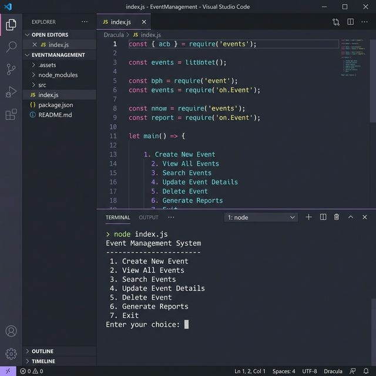
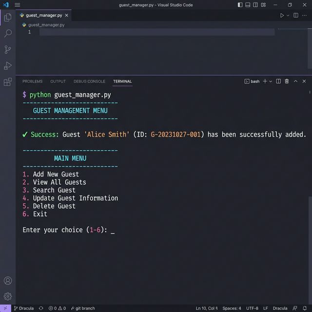
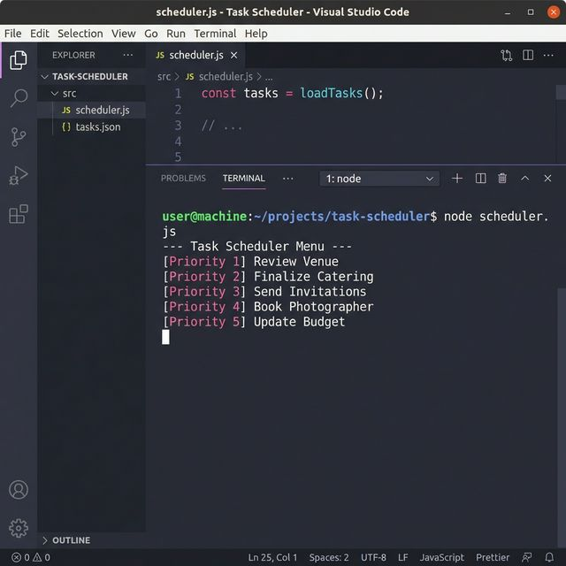
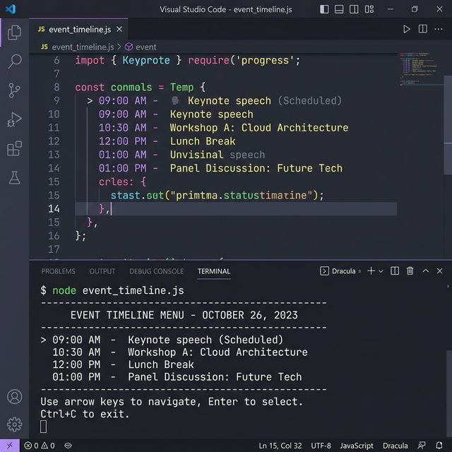
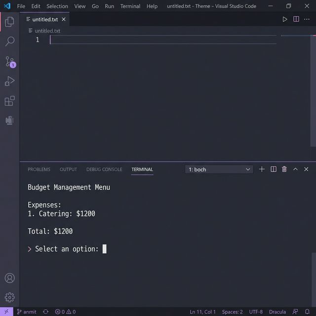
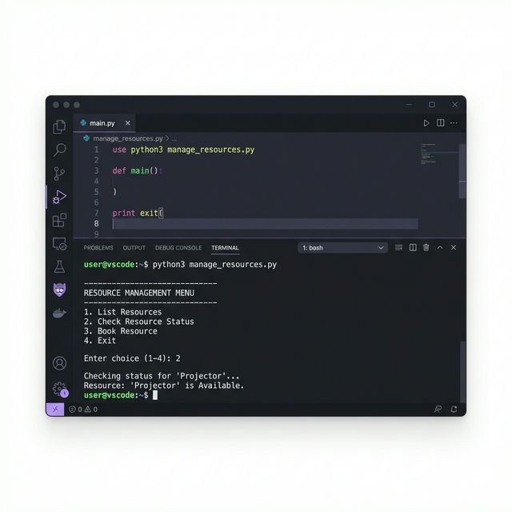
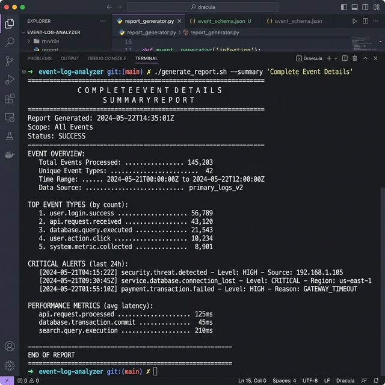

# 🗓️ Event Management System (Java)

A comprehensive, console-based application designed to streamline event planning and management. This system provides a robust set of tools for managing guests, tasks, timelines, budgets, and resources using Object-Oriented Programming (OOP) principles in Java.



---

## 🚀 Quick Start

### Prerequisites
- **Java Development Kit (JDK) 8 or higher**
- Any terminal or command prompt

### Installation & Run
1. **Clone the repository:**
   ```bash
   git clone https://github.com/CoderHere07/Event-Management-System-Java-.git
   cd Event-Management-System-Java-
   ```

2. **Compile the source files:**
   ```bash
   javac Main.java
   ```

3. **Run the application:**
   ```bash
   java Main
   ```

---

## 🛠️ Features

### 👥 Guest Management
Efficiently handle your event's guest list. Add guest details, track contact information, and manage room assignments.
- **Add Guest:** Capture name, contact, email, address, and room number.
- **View All Guests:** Display a formatted list of all registered guests.



### 🗓️ Task Scheduler
Stay on top of every requirement with a dedicated task management system.
- **Manage Tasks:** Add, remove, and track task completion.
- **Deadline Tracking:** View the next pending task to ensure nothing is missed.



### ⏳ Event Timeline
Maintain a chronological flow of activities for your event.
- **Activity Log:** Add events with specific times and locations.
- **Chronological Flow:** View the entire event schedule in sequence.



### 💰 Budget Management
Keep your finances in check with integrated expense tracking.
- **Expense Tracking:** Add expenses by category and amount.
- **Financial Control:** Undo last entries, find expenses by category, and clear all data.



### 📦 Resource Management
Allocate and monitor all physical items and equipment needed for your event.
- **Inventory Control:** Add, update, and remove resources.
- **Availability Check:** Instantly check if a specific resource is available in the required quantity.



---

## 📊 Complete Event Overview
Get a high-level summary of all event modules in one single view.



---

## 📂 Project Structure

- `Main.java`: The entry point and coordination hub for all modules.
- `Guest Management`: Handles `Guest.java` and `GuestManagement.java` for attendee tracking.
- `TaskScheduler.java`: Manages the queue and status of event-related tasks.
- `EventTimeline.java`: Orchestrates the chronological flow of the event.
- `BudgetManagement.java`: Handles the financial logic and expense tracking.
- `ResourceManager.java`: Manages the inventory and availability of event assets.

---

## 💻 Technologies Used
- **Language:** Java
- **Styling:** Console-based UI with interactive menus
- **Patterns:** Object-Oriented Design (Classes, Encapsulation, Lists)

---

## 🤝 Contributing
Contributions are welcome! Please feel free to submit a Pull Request.
